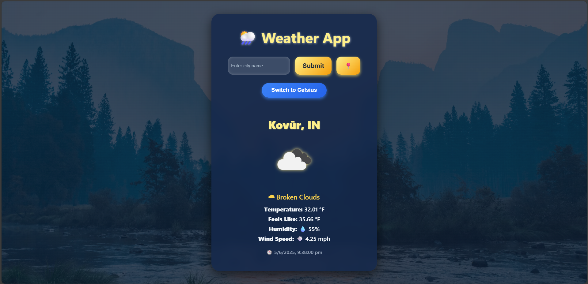

# 🌦️ Weather App - React

A beautiful, responsive, and feature-rich weather application built with **React**. It fetches live weather data from the **OpenWeatherMap API**, supports temperature conversion between Celsius and Fahrenheit, and can fetch weather for the user's **current location**.

---

## 🚀 Features

- 🔍 Search weather by city name
- 📍 Get weather using your current geolocation
- 🌡️ Toggle between Celsius (°C) and Fahrenheit (°F)
- 🧭 Displays:
  - City and country
  - Temperature
  - Feels like temperature
  - Humidity
  - Wind speed
  - Weather description and icon
- ✅ Handles errors and invalid inputs gracefully
- 🎨 Beautiful weather-themed responsive UI

---

## 🖼️ Demo UI



---


## 📦 Installation & Setup

1. **Clone this repository**
   ```bash
   git clone https://github.com/your-username/weather-app-react.git
   cd weather-app-react
